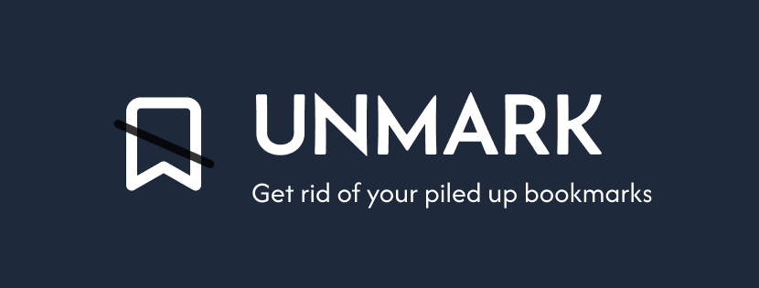

<br />

Tired of pilled up bookmarks? Add reminders to bookmarks and visit them later or cleanup bookmarks easily.

<br />

> [!Warning]
>
> The extension is not stable yet

## Table of contents

- [Introduction](#introduction)
- [Features](#features)
- [Tech Stack](#tech-stack)
- [References](#references)
- [Develop locally](#develop-locally)

### Introduction

Unmark is an open source chrome extension built out of the frustration of piled of bookmarks. While bookmark is a great feature provided by `chrome`, they often just sit collecting digital dust. So instead of just bookmarking tabs next time use **Unmark** to add reminder and visit the bookmark later, read through it and unmark it.

### Features

- [x] Google bookmarks listing
- [ ] Sorting and searching of bookmarks
- [x] Reminder to individual bookmark
- [ ] Reminder to folder
- [ ] Easy unmarking of bookmark(s)

### Tech stack

I have used `React Typescript` with `Vite` as the bundle tool in order to build the UI and state of the extension.

I am also using `chrome API` specifically `bookmarks, alarm, notification, sidepanel and background APIs`

### References

- [Chrome extension manifest docs](https://developer.chrome.com/docs/extensions/reference/manifest)
- [Chrome notification API docs](https://developer.chrome.com/docs/extensions/reference/api/notifications)
- [Chrome sidePanel API docs](https://developer.chrome.com/docs/extensions/reference/api/sidePanel)
- [Chrome alarm API docs](https://developer.chrome.com/docs/extensions/reference/api/alarms)
- [Chrome bookmarks API docs](https://developer.chrome.com/docs/extensions/reference/api/bookmarks)
- [Chrome tabs API docs](https://developer.chrome.com/docs/extensions/reference/api/tabs)
- [Youtube - Bookmark override extension](https://youtu.be/eN_tMfGMD5E?si=1IKYhpPCZwBc1ef5)
- [Youtube - Setting vite and react for chrome extension development](https://www.youtube.com/watch?v=xOf0laMjKnM)

### Develop locally

The project is `MIT Licensed` Open source project you are free to clone it, further develop it and distribute it.

To develop locally following following steps:

<details>
  <summary><b>Windows</b></summary>

- Clone the project

```terminal
git clone https://github.com/alsongarbuja/unmark.git
```

- Cd into the project and install dependencies

```shell
cd unmark && pnpm install
```

> [!Note]
>
> Development command is currently being worked on

- Build the project

```shell
pnpm build
```

- Load the build folder into chrome extension which you can do by following the steps in the [chrome extention getting started docs](https://developer.chrome.com/docs/extensions/get-started/tutorial/hello-world)

</details>
